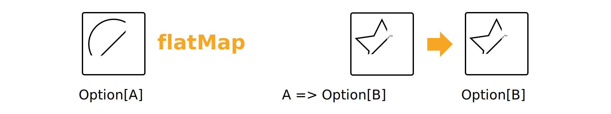

# Scala-Ceiba

## Functional Programming Principles in Javascript

### Que es la programacion funcional?

La programación funcional es un paradigma de programación declarativa que se basa en construir software utilizando funciones puras y evitando el cambio de estado y la mutación de datos. En lugar de especificar cómo hacer algo (como en la programación imperativa), la programación funcional se centra en especificar qué se quiere hacer.

### Funciones puras

¿Cómo sabemos si una función es pura o no? He aquí una definición muy estricta de pureza:

- Son aquellas que, dada la misma entrada, siempre producirán la misma salida y no tendrán ningún efecto secundario.
- No provoca efectos secundarios observables.

#### Ejemplo de funcion pura

```scala
def suma(a: Int, b: Int): Int = {
  return a + b
}
```

Es pura porque siempre que se llame con los mismos argumentos, devolverá el mismo resultado y no tiene efectos secundarios.

#### Ejemplo de funcion impura

```scala
def suma(a: Int, b: Int): Int = {
  println("La suma de " + a + " + " + b + " es: " + (a + b))
  return a + b
}
```

Es impura porque imprime en la consola, lo que es un efecto secundario.

### Funcion impura lectura de archivos

```scala
def charactersCounter(text: String): Int = text.length


def analyzeFile(filename: String): String = {
  val file = new File(filename)
  val contents = file.read()
  return charactersCounter(contents)
}

```

La función analyzeFile(filename) no es pura porque su salida depende del contenido del archivo especificado por filename, que puede cambiar con el tiempo. Esto significa que la misma entrada (es decir, el mismo nombre de archivo) puede producir diferentes salidas en diferentes momentos, violando la primera condición.

charactersCounter(text) sí es una función pura porque para un text dado, siempre producirá la misma salida y no tiene efectos secundarios. No modifica ni interactúa con ningún estado fuera de la función.

### Funciones impuras numeros aleatorios

Cualquier función que dependa de un generador de números aleatorios no puede ser pura.

```scala
def random(): Int = {
  return System.nanoTime()
}

def randomBetween(min: Int, max: Int): Int = {
  return min + random() % (max - min)
}
```

Las funciones puras son estables, coherentes y predecibles. Dados los mismos parámetros, las funciones puras siempre devolverán el mismo resultado. No necesitamos pensar en situaciones en las que el mismo parámetro tenga resultados diferentes, porque nunca ocurrirá.

### Ventajas de las funciones puras

El código es definitivamente más fácil de probar. No necesitamos simular nada. Así que podemos probar unitariamente funciones puras con diferentes contextos:

- Dado un parámetro A ➡️ esperar que la función devuelva el valor B
- Dado un parámetro C ➡️ esperar que la función devuelva el valor D

Ejemplo de funcion pura 

```scala
val lista = List(1, 2, 3, 4, 5)

def incrementarNumeros(lista: List[Int]): List[Int] = lista.map(numero => numero + 1)

incrementarNumeros(lista) // List(2, 3, 4, 5, 6)
```

Para la entrada de [1,2,3,4,5] siempre obtendremos la salida [2,3,4,5,6].

## Inmutabilidad

Inmutable en el tiempo o incapaz de modificarse. En programación, la inmutabilidad es un concepto que se refiere a la incapacidad de un objeto de cambiar su valor de estado después de su creación.

### Ejemplo de inmutabilidad

```javascript
var values = [1, 2, 3, 4, 5];
var sumOfValues = 0;

for (var i = 0; i < values.length; i++) {
  sumOfValues += values[i];
}

sumOfValues // 15
```

Para cada iteración, estamos cambiando el i y el estado sumOfValue. Pero, ¿cómo manejamos la mutabilidad en la iteración? Recursión.

```javascript
var values = [1, 2, 3, 4, 5];
let accumulator = 0;

function sum(list, accumulator) {
  if (list.length == 0) {
    return accumulator;
  }

  return sum(list.slice(1), accumulator + list[0]);
}

sum(list, accumulator); // 15
list; // [1, 2, 3, 4, 5]
accumulator; // 0
```

Así que aquí tenemos la función suma que recibe un vector de valores numéricos. La función se llama a sí misma hasta que obtenemos la lista vacía (nuestro caso base de recursividad). En cada "iteración" añadiremos el valor al acumulador total.

### Ejemplo de inmutabilidad URL

En programacion orientada a objetos se tiene un metodo para convertir un string a url slug es decir que se reemplazan los espacios por guiones y se convierte a minusculas.

```ruby
class UrlSlugify
  attr_reader :text
  
  def initialize(text)
    @text = text
  end

  def slugify!
    text.downcase!
    text.strip!
    text.gsub!(' ', '-')
  end
end

UrlSlugify.new(' I will be a url slug   ').slugify! # "i-will-be-a-url-slug"
```

En este ejemplo se puede ver que el metodo slugify! Que hace los cambios en el texto para convertirlo en un slug, sin embargo el metodo esta modificando el texto original, lo cual es un problema porque si se quiere usar el texto original en otro lugar ya no se podra.

Como alternativa se puede realizar una funcion que sea una composicion de funciones sin tener que modificar que string original

```javascript
const string = " I will be a url slug   ";

const slugify = string =>
  string
    .toLowerCase()
    .trim()
    .split(" ")
    .join("-");

slugify(string); // i-will-be-a-url-slug
string; // " I will be a url slug   "
```

- toLowerCase() convierte el string a minusculas
- trim() elimina los espacios en blanco al inicio y al final del string
- split(" ") divide el string en un array de strings
- join("-") une el array de strings en un string usando guiones

## Transparencia referencial

La transparencia referencial es un concepto que nos permite reemplazar una expresión por su valor sin cambiar el comportamiento del programa.

funciones puras + datos inmutables = transparencia referencial

Con la transparencia referencial, podemos memoizar la funcion y guardar el resultado en cache para que no se tenga que volver a ejecutar la funcion con los mismos parametros.

```javascript
const sum = (a, b) => a + b
```

Se llama con los siguientes parametros

```javascript
sum(3, sum(5, 8));
```

La suma de 5 y 8 es igual a 13, por lo que la expresion se puede reemplazar por

```javascript
sum(3, 13);
```

Y esta expresión siempre dará como resultado 16. Podemos sustituir toda la expresión por una constante numérica y memorizarla.

## Funciones como entidades de primera clase

En programación funcional, las funciones son ciudadanos de primera clase, lo que significa que son tratadas como cualquier otra variable, tienen las siguientes características:

- hacer referencia a él desde constantes y variables
- pasarlo como parámetro a otras funciones
- devolverlo como resultado de otras funciones

La principal idea es tratar a las funciones como valores y pasarlas a otras funciones para que las ejecuten y crear nuevas funciones a partir de las existentes.

Ejemplo de funciones como entidades de primera clase

```javascript
const doubleSum = (a, b) => (a + b) * 2;
const doubleSubtraction = (a, b) => (a - b) * 2;


// Se puede hacer esto con funciones de primera clase
const sum = (a, b) => a + b;
const subtraction = (a, b) => a - b;
const doubleOperator = (f, a, b) => f(a, b) * 2;

doubleOperator(sum, 3, 1); // 8
doubleOperator(subtraction, 3, 1); // 4
```

Ahora tenemos un argumento f, y lo usamos para procesar a y b. Pasamos las funciones suma y resta para componer con la función doubleOperator y crear un nuevo comportamiento.

## Funciones de orden superior

Las funciones de orden superior son funciones que pueden tomar otras funciones como argumentos o devolverlas como resultado.

Un buen ejemplo de son las funciones filter, map y reduce de los arrays.

### Filter

Dada una colección, devuelve una colección filtrada por una condición dada como funcion, es decir que se le pasa una funcion que devuelve un booleano y se filtra la coleccion con los elementos que devuelven true.

Ejemplo de filtrar numeros par con un enfoque imperativo

```javascript

const numbers = [1, 2, 3, 4, 5, 6];
var evenNumbers = [];

for (var i = 0; i < numbers.length; i++) {
  if (numbers[i] % 2 == 0) {
    evenNumbers.push(numbers[i]);
  }
}

console.log(evenNumbers); // (6) [0, 2, 4, 6, 8, 10]
```

Sin embargo se puede usar la funcion de orden superior filter

```javascript
const numbers = [1, 2, 3, 4, 5, 6];
const even = n => n % 2 == 0;

const evenNumbers = numbers.filter(even);

console.log(evenNumbers); // (6) [0, 2, 4, 6, 8, 10]
```

También podemos hacerlo con mapas. Imagina que tenemos un mapa de personas con su nombre y edad. Queremos filtrar sólo las personas que superen un valor determinado de edad, en este ejemplo las personas que tengan más de 21 años.

```javascript
let people = [
  { name: "TK", age: 26 },
  { name: "Kaio", age: 10 },
  { name: "Kazumi", age: 30 }
];

const olderThan21 = person => person.age > 21;
const overAge = people => people.filter(olderThan21);
overAge(people); // [{ name: 'TK', age: 26 }, { name: 'Kazumi', age: 30 }]
```

### Map

Dada una colección, devuelve una colección con cada elemento transformado por una función dada.

Aprovechando el ejemplo anterior, podemos usar map para transformar cada elemento de la colección en un string con el nombre de la persona y edad.

```javascript
const makeSentence = (person) => `${person.name} is ${person.age} years old`;

const peopleSentences = (people) => people.map(makeSentence);
  
peopleSentences(people);
// ['TK is 26 years old', 'Kaio is 10 years old', 'Kazumi is 30 years old']
```

La idea es transformar una array dado en una nuevo array.

### Reduce

Dada una colección y una función, devuelve un valor que es la reducción de esa colección. La función reduce recibe dos parámetros, el primero es la función que se va a ejecutar y el segundo es el valor inicial.

Un ejemplo habitual del que habla la gente es obtener el importe total de un pedido. Imagina que estás en un sitio web de compras. Has añadido el Producto 1, el Producto 2, el Producto 3 y el Producto 4 a tu cesta de la compra (pedido). Ahora queremos calcular el importe total del carrito de la compra.

```javascript
let shoppingCart = [
  { productTitle: "Product 1", amount: 10 },
  { productTitle: "Product 2", amount: 30 },
  { productTitle: "Product 3", amount: 20 },
  { productTitle: "Product 4", amount: 60 }
];

const sumAmount = (currentTotalAmount, order) => currentTotalAmount + order.amount;

const getTotalAmount = (shoppingCart) => shoppingCart.reduce(sumAmount, 0);

getTotalAmount(shoppingCart); // 120
```

La función reduce recibe dos parámetros, el primero es la función que se va a ejecutar y el segundo es el valor inicial. En este caso, el valor inicial es 0 porque queremos que el importe total comience en 0 y luego se sume a medida que se procesan los pedidos.

## Ejemplo de funciones de orden superior

Hablando del carrito de la compra, imaginemos que tenemos esta lista de productos en nuestro pedido:

Queremos el importe total de todos los libros de nuestra cesta de la compra. Así de sencillo. ¿El algoritmo?

- filtrar por tipo de libro
- transformar la cesta de la compra en una colección de importes usando map
- combinar todos los artículos sumándolos con reduce

```javascript
let shoppingCart = [
  { productTitle: "Functional Programming", type: "books", amount: 10 },
  { productTitle: "Kindle", type: "eletronics", amount: 30 },
  { productTitle: "Shoes", type: "fashion", amount: 20 },
  { productTitle: "Clean Code", type: "books", amount: 60 }
];

let shoppingCart = [
  { productTitle: "Functional Programming", type: "books", amount: 10 },
  { productTitle: "Kindle", type: "eletronics", amount: 30 },
  { productTitle: "Shoes", type: "fashion", amount: 20 },
  { productTitle: "Clean Code", type: "books", amount: 60 }
]

const byBooks = (order) => order.type == "books";
const getAmount = (order) => order.amount;
const sumAmount = (acc, amount) => acc + amount;

function getTotalAmount(shoppingCart) {
  return shoppingCart
    .filter(byBooks)
    .map(getAmount)
    .reduce(sumAmount, 0);
}

getTotalAmount(shoppingCart); // 70

```

### Case Classes

Las case classes son clases que tienen un constructor por defecto, getters y setters para los atributos y métodos equals, hashCode y toString implementados.

```scala
case class Person(firstName: String, lastName: String) {
  def name = firstName + " " + lastName
}
```

Las case clase automaticamente son generadas por Scala con objeto de compañia.

- ToString para mostrar el objeto en forma de string con el nombre de la clase y los valores de los atributos, como si fuera el constructor, de esa manera se evita el @ y el hashcode.

```scala
val person = Person("Juan", 30)

person.toString // Person(Juan,30)
```

- Equals sensible, y hashCode métodos que operan sobre los valores de campo en el objeto.

```scala
new Person("Noel", "Welsh").equals(new Person("Noel", "Welsh"))
// res3: Boolean = true

new Person("Noel", "Welsh") == new Person("Noel", "Welsh")
// res4: Boolean = true
```

- Un método de copy que crea un nuevo objeto con los mismos valores de campo que el actual:

```scala
val person = Person("Juan", 30)
person.copy(age = 22) // Person = Person(Juan,22)
```

- Las clases Case implementan dos rasgos: java.io.Serializable y scala.Product. Ninguno de los dos se utiliza directamente. Este último proporciona métodos para inspeccionar el número de campos y el nombre de la clase case.

- El objeto compañero contiene un método apply con los mismos argumentos que el constructor de la clase. Los programadores de Scala tienden a preferir el método apply sobre el constructor por la brevedad de omitir new
  
### Case Objects

- Los objetos case son como las clases case, excepto que no tienen constructores de parámetros y no se puede instanciar con new. Son útiles para representar valores atómicos, Un objeto case se define igual que un objeto singleton normal, pero tiene un método toString más significativo y extiende los rasgos Product y Serializable

```scala
case object Citizen {
  def firstName = "John"
  def lastName  = "Doe"
  def name = firstName + " " + lastName
}

Citizen.toString // Citizen
```

### Pattern Matching

Las clases case permiten una nueva forma de interacción, llamada concordancia de patrones. La concordancia de patrones nos permite separar una clase case y evaluar diferentes expresiones dependiendo de lo que contenga la clase case.

```scala
expr0 match {
  case pattern1 => expr1
  case pattern2 => expr2
  ...
}
```

- un nombre, vinculando cualquier valor a ese nombre;
- un guión bajo, que coincide con cualquier valor y lo ignora
- un literal, que coincide con el valor que el literal denota; o
- un patrón estilo constructor para una clase case.

```scala
object ChipShop {
  def willServe(cat: Cat): Boolean =
    cat match {
      case Cat(_, _, "Chips") => true
      case Cat(_, _, _) => false
      case _ => false
    }
}
```

### Traits

Los traits son como interfaces en Java, pero con implementaciones. Los rasgos pueden tener métodos y campos, y pueden proporcionar implementaciones predeterminadas para los métodos. Los traits pueden extenderse por clases y otros rasgos, pero no pueden tomar parámetros de tipo de clase. Es una especide mezcla entre las interfaces de Java y las clases abstractas.

```scala
import java.util.Date

trait Visitor {
  def id: String      // Unique id assigned to each user
  def createdAt: Date // Date this user first visited the site

  // How long has this visitor been around?
  def age: Long = new Date().getTime - createdAt.getTime
}

case class Anonymous(
  id: String,
  createdAt: Date = new Date()
) extends Visitor

case class User(
  id: String,
  email: String,
  createdAt: Date = new Date()
) extends Visitor

```

Sintaxis usada para un trait

```scala
//Declaracion
trait TraitName {
  declarationOrExpression ...
}
//Declarar que una clase es un subtipo de un trait
class Name(...) extends TraitName {
  ...
}
//Declarar que un case class es un subtipo de un trait
case class Name(...) extends TraitName {
 ...
}

### Traits vs Classes

- Un trait no puede tener un constructor: no podemos crear objetos directamente a partir de un trait. En su lugar, podemos utilizar un trait para crear una clase, y luego crear objetos a partir de esa clase. Podemos basar tantas clases como queramos en un trait.
- Los traits pueden definir métodos abstractos que tienen nombres y firmas de tipo pero no implementación. Hemos visto esto en el trait Visitante. Debemos especificar la implementación cuando creamos una clase que extiende el trait, pero hasta ese momento somos libres de dejar las definiciones abstractas.

```scala
trait Visitor {
  def id: String      // Unique id assigned to each user
  def createdAt: Date // Date this user first visited the site
}
```

id y createdAt son abstractos, por lo que deben definirse en las clases que los extienden. Nuestras clases los implementan como vals en lugar de defs. Esto es legal en Scala, que ve def como una versión más general de val. Es una buena práctica no definir nunca vals en un trait, sino usar def. Una implementación concreta puede entonces implementarlo usando def o val según sea apropiado.

### Sealed Traits

Un trait sellado es un trait que no puede tener implementaciones de clases fuera del archivo en el que está definido. Esto permite que el compilador verifique que la concordancia de patrones es exhaustiva.

Aún podemos extender los subtipos de un rasgo sellado fuera del fichero donde están definidos. Por ejemplo, podríamos extender Usuario o Anónimo en otro lugar. Si queremos evitar esta posibilidad debemos declararlos como sellados (si queremos permitir extensiones dentro del fichero) o final si queremos desautorizar todas las extensiones. Para el ejemplo de los visitantes probablemente no tenga sentido permitir ninguna extensión a Usuario o Anónimo, así que el código simplificado debería tener este aspecto:

```scala
//definicion de un trait sellado
sealed trait TraitName {
  ...
}

//definicion de una clase final para no permitir extensiones
final case class Name(...) extends TraitName {
  ...
}

sealed trait Visitor { /* ... */ }
final case class User(/* ... */) extends Visitor
final case class Anonymous(/* ... */) extends Visitor

// Ejemplo de division de un numero
sealed trait DivisionResult
final case class Finite(value: Int) extends DivisionResult
case object Infinite extends DivisionResult

object divide {
  def apply(num: Int, den: Int): DivisionResult =
    if(den == 0) Infinite else Finite(num / den)
}

divide(1, 0) match {
  case Finite(value) => s"It's finite: ${value}"
  case Infinite      => s"It's infinite"
}
// res34: String = It's infinite

```

## Modelando Datos con Traits

### Algebraic Data Types

#### Product Types

Los tipos de producto son tipos que tienen más de un valor. Por ejemplo, un tipo de producto que representa un usuario puede tener un valor para un usuario anónimo y un valor para un usuario registrado. Un Visitor tiene un id y una fecha de creacion.

```scala
case class A(b:B, c:C)

//Alternativa
trait A{
  def b: B
  def c: C
}
```

#### Sum Types

Los tipos de suma son tipos que tienen más de un tipo de valor. Por ejemplo, UUn felino es un gato, leon o tigre.

```scala
sealed trait A
case class B() extends A
case class C() extends A
```

#### Is-a-and

```scala
trait B
trait C
trait A extends B with C
```

A es b y c

#### has-a-or

A es b o c

```scala
trait A {
  def d: D
}
sealed trait D
final case class B() extends D
final case class C() extends D

//Alternativa
sealed trait A
final case class D(b: B) extends A
final case class E(c: C) extends A
```

### Structural Recursion

#### El product type Polimorfismo Pattern

A tiene un b y un c, se quiere escribir un metodo f que retorne un f

```scala
case class A(b: B, c: C) {
  def f: F = ???
}
```

#### La Sum Type Polimorfismo Pattern

A es b o c, se quiere escribir un metodo f que retorne un f

```scala
sealed trait A {
  def f: F 
}
final case class B() extends A {
  def f: F = ???
}
final case class C() extends A {
  def f: F = ???
}
```

#### Product Type Pattern Matching Pattern

A tiene un b y un c, se quiere escribir un metodo f que retorne un f

```scala
def f(a: A): F =
  a match {
    case A(b, c) => ???
  }
```

#### Sum Type Pattern Matching Pattern

A es b o c, se quiere escribir un metodo f que retorne un f

```scala
def f(a: A): F =
  a match {
    case B() => ???
    case C() => ???
  }
```

### Recursion Alegbraica Data Types Pattern

Cuando se definen tipos de datos algebraicos recursivos, debe haber al menos dos casos: uno que sea recursivo y otro que no lo sea. Los casos que no son recursivos se conocen como casos base. En código, el esqueleto general es

```scala
sealed trait RecursiveExample
final case class RecursiveCase(recursion: RecursiveExample) extends RecursiveExample
case object BaseCase extends RecursiveExample
```

Al escribir código estructuralmente recursivo en un tipo de datos algebraico recursivo:

- siempre que encontremos un elemento recursivo en los datos hacemos una llamada recursiva a nuestro método; y
- siempre que encontremos un caso base en los datos devolvemos la identidad para la operación que estamos realizando

#### Comprender el caso base y el caso recursivo

- Para el caso base, generalmente deberíamos devolver la identidad de la función que estamos intentando calcular. La identidad es un elemento que no cambia el resultado. Por ejemplo, 0 es la identidad de la suma, porque a + 0 == a para cualquier a. Si estuviéramos calculando el producto de elementos, la identidad sería 1, ya que a * 1 == a para todo a.
- Para el caso recursivo, asume que la recursión devolverá el resultado correcto y calcula lo que necesitas sumar para obtener la respuesta correcta. Hemos visto esto para la suma, donde asumimos que la llamada recursiva nos dará el resultado correcto para la cola de la lista y entonces simplemente sumamos en la cabeza.
  
#### Ejemplo de recursion

```scala
sealed trait IntList
case object End extends IntList
final case class Pair(head: Int, tail: IntList) extends IntList

def sum(list: IntList): Int =
  list match {
    case End => 0 // Caso base
    case Pair(hd, tl) => hd + sum(tl) // Llamada recursiva, asumimos que sum(tl) es correcto
  }


val example = Pair(1, Pair(2, Pair(3, End))) // 1, 2, 3
assert(sum(example) == 6)
assert(sum(example.tail) == 5)
assert(sum(End) == 0)

```

### Tail Recursion

La recursión de cola es una técnica de optimización que permite que algunas funciones recursivas se ejecuten en un espacio constante de memoria. La idea es que la llamada recursiva sea la última operación que se realiza en la función. Cuando esto sucede, la función no necesita mantener el estado de la llamada actual en la pila. En su lugar, puede reemplazar la llamada actual por la llamada recursiva.

```scala
// Ejemplo de Tail Recursion
def method1: Int =
  1

def tailCall: Int =
  method1 // tailCall no necesita mantener el estado de la llamada actual en la pila, porque tailCall devuelve inmediatamente el resultado de llamar al método1

// Ejemplo de No Tail Recursion
def notATailCall: Int =
  method1 + 2 // notATailCall necesita mantener el estado de la llamada actual en la pila, porque notATailCall necesita sumar el resultado de llamar al método1 con 2

```

Existe una anotación @tailrec que se puede usar para verificar que una función se está optimizando correctamente. Si la función no se optimiza correctamente, el compilador nos avisará.

```scala

@tailrec
def sum(list: IntList): Int =
  list match {
    case End => 0
    case Pair(hd, tl) => hd + sum(tl)
  }
// Error: could not optimize @tailrec annotated method sum: it contains a recursive call not in tail position


// Convirtiendo la funcion a tail recursion
@tailrec
def sum(list: IntList, total: Int = 0): Int =
  list match {
    case End => total
    case Pair(hd, tl) => sum(tl, total + hd)
  }


```

## Ejericios interesantes

### Option

Asignar valores por defecte utilizando pattern matching

```scala
val someValue: Option[Double] = Some(20.0)
val value = someValue match {
  case Some(v) => v
  case None => 0.0
}
```

### Object Singleton

Uso de atributos privados desde el object compani

```scala
class Person(
  val name: String,
  private val superheroName: String) //The superhero name is private!

object Person {
  def showMeInnerSecret(x: Person) = x.superheroName
}

val clark = new Person("Clark Kent", "Superman")
val peter = new Person("Peter Parker", "Spider-Man")

Person.showMeInnerSecret(clark) should be(
"Superman"
)
Person.showMeInnerSecret(peter) should be(
"Spider-Man"
)
```

### Functions Types

```scala
//declarar una funcion type
(A, B, ...) => C
```

- Donde A, B, ... son los tipos de los parametros de la funcion
- C es el tipo de retorno de la funcion

```scala
//declarar una funcion type con un solo parametro
A => B
```

### Fold Pattern

Para un tipo de datos algebraico A, fold lo convierte en un tipo genérico B. Fold es una recursión estructural con:

- un parámetro de función para cada caso de A;
- cada función toma como parámetros los campos de su clase asociada;
- si A es recursivo, cualquier parámetro de función que se refiera a un campo recursivo toma un parámetro de tipo B.

### Funciones extreme shorthand

```scala
((_: Int) * 2) // expandiendo la funcion (a: Int) => a * 2
_ + _     // expandiendo la funcion`(a, b) => a + b`
foo(_)    // expandiendo la funcion `(a) => foo(a)`
foo(_, b) // expandiendo la funcion`(a) => foo(a, b)`
_(foo)    // expandiendo la funcion`(a) => a(foo)`
```

## Cats

### Type Class

Una type class es una interfaz que especifica algún comportamiento que queremos que un tipo de datos en particular tenga. El tipo de datos no es parte de la type class, pero en su lugar se define en otro lugar. Esto es diferente de una clase en un lenguaje orientado a objetos, donde la clase y la interfaz son lo mismo. En Cats, una clase de tipo está representada por un rasgo con al menos un parámetro de tipo

```scala
trait JsonWriter[A] {
  def write(value: A): Json
}
```

JsonWriter es nuestra clase de tipo en este ejemplo, con Json y sus subtipos proporcionando código de soporte.

### Type Class Instances

Una instancia de clase de tipo es una implementación de los métodos de una clase de tipo para un tipo de datos específico. En Cats, las instancias de clase de tipo se representan con objetos singleton.En Scala definimos instancias creando implementaciones concretas de la clase de tipo y etiquetándolas con la palabra clave implícita, Por ejemplo, podríamos definir una instancia de clase de tipo para nuestro tipo de datos Person como:

```scala
final case class Person(name: String, email: String)

object JsonWriterInstances {
  implicit val stringWriter: JsonWriter[String] =
    new JsonWriter[String] {
      def write(value: String): Json =
        JsString(value)
    }

  implicit val personWriter: JsonWriter[Person] =
    new JsonWriter[Person] {
      def write(value: Person): Json =
        JsObject(Map(
          "name" -> JsString(value.name),
          "email" -> JsString(value.email)
        ))
    }

  // etc...
}
```

### Type Class Interfaces

Una interfaz de clase de tipo es cualquier funcionalidad que expone los métodos de una clase de tipo al usuario. En Cats, las interfaces de clase de tipo se representan con objetos singleton o clases estáticas que aceptan instancias de clase de tipo en sus métodos. Una interfaz de clase de tipo es cualquier funcionalidad que exponemos a los usuarios. Las interfaces son métodos genéricos que aceptan instancias de la clase de tipo como parámetros implícitos.

#### Interface Objects

La forma más sencilla de crear una interfaz es colocar métodos en un objeto singleton:

```scala
object Json {
  def toJson[A](value: A)(implicit w: JsonWriter[A]): Json =
    w.write(value)
}
```

Para utilizar este objeto, importamos cualquier instancia de clase de tipo que nos interese y llamamos al método correspondiente:

```scala
import JsonWriterInstances._

Json.toJson(Person("Dave", "dave@example.com"))
// res4: Json = JsObject(Map(name -> JsString(Dave), email -> JsString(dave@example.com)))
```

#### Interface Syntax

También podemos utilizar métodos de extensión para ampliar los tipos existentes con métodos de interfaz. Cats denomina a esto "sintaxis" de la clase de tipos:

```scala
object JsonSyntax {
  implicit class JsonWriterOps[A](value: A) {
    def toJson(implicit w: JsonWriter[A]): Json =
      w.write(value)
  }
}
```

Utilizamos la sintaxis de interfaz importándola junto con las instancias de los tipos que necesitamos:

```scala
import JsonWriterInstances._
import JsonSyntax._

Person("Dave", "dave@example.com").toJson
// res6: Json = JsObject(Map(name -> JsString(Dave), email -> JsString(dave@example.com)))
```

#### Implicity Method

La biblioteca estándar de Scala proporciona una interfaz de clase de tipo genérico llamada implicitly. Su definición es muy simple, podemos utilizar implicitly para invocar cualquier valor de ámbito implícito. Proporcionamos el tipo que queremos e implicitly hace el resto

```scala
import JsonWriterInstances._
// import JsonWriterInstances._

implicitly[JsonWriter[String]]
// res8: JsonWriter[String] = JsonWriterInstances$$anon$1@38563298
```

La mayoría de las clases de tipos en Cats proporcionan otros medios para invocar instancias. Sin embargo, implicitly es un buen recurso para propósitos de depuración. Podemos insertar una llamada a implicitly dentro del flujo general de nuestro código para asegurar que el compilador puede encontrar una instancia de una clase de tipo y asegurar que no hay errores implícitos ambiguos.

#### Working with Implicits

#### Packaging Implicits

En una curiosa peculiaridad del lenguaje, cualquier definición marcada como implícita en Scala debe ser colocada dentro de un objeto o trait en lugar de en el nivel superior. Colocar instancias en un objeto compañero de la clase de tipo tiene un significado especial en Scala porque juega con algo llamado ámbito implícito.

#### Implicit Scope

Como vimos anteriormente, el compilador busca instancias de clase de tipo candidatas por tipo. Por ejemplo, en la siguiente expresión buscará una instancia de tipo JsonWriter[String]:

```scala
Json.toJson("A string!")
```

El compilador busca instancias candidatas en el ámbito implícito en el lugar de la llamada, que consiste aproximadamente en:

- definiciones locales o heredadas;
- definiciones importadas;
- en el objeto compañero de la clase de tipo o del tipo de parámetro (en este caso JsonWriter o String).

Las definiciones sólo se incluyen en el ámbito implícito si están etiquetadas con la palabra clave implicit. Además, si el compilador ve varias definiciones candidatas, falla con un error de valores implícitos ambiguos.

podemos empaquetar instancias de clase de tipo aproximadamente de cuatro maneras:

1. colocándolos en un objeto como JsonWriterInstances;
2. colocándolos en un rasgo;
3. colocándolos en el objeto compañero de la clase de tipo;
4. colocándolos en el objeto compañero del tipo de parámetro.

Con la opción 1 introducimos las instancias en el ámbito de aplicación importándolas. Con la opción 2 las introducimos en el ámbito mediante herencia. Con las opciones 3 y 4, las instancias siempre están en el ámbito implícito, independientemente de dónde intentemos utilizarlas.

##### Implicit Conversions

Cuando cree un constructor de instancia de clase de tipo utilizando una def implícita, asegúrese de marcar los parámetros del método como parámetros implícitos. Sin esta palabra clave, el compilador no podrá rellenar los parámetros durante la resolución implícita.

#### Meet Cats

Cats está escrito utilizando una estructura modular que nos permite elegir qué clases de tipos, instancias y métodos de interfaz queremos utilizar. Echemos un primer vistazo usando cats.Show como ejemplo.

Show proporciona un mecanismo para producir una salida de consola amigable para el desarrollador sin usar toString. He aquí una definición abreviada:

```scala
package cats

trait Show[A] {
  def show(value: A): String
}
```

#### Importando Type Classes

Las clases de tipo en Cats están definidas en el paquete cats. Podemos importar Show directamente de este paquete:
  
  ```scala
  import cats.Show
  ```

#### Importing Default Instances

El paquete cats.instances proporciona instancias por defecto para una amplia variedad de tipos. Podemos importarlos como se muestra en la tabla siguiente. Cada importación proporciona instancias de todas las clases de tipos de Cats para un tipo de parámetro específico:

```scala
import cats.instances.int  // proporciona instancias para Int
import cats.instances.string // proporciona instancias para String
import cats.instances.list // proporciona instancias para List
import cats.instances.option // proporciona instancias para Option
import cats.instances.all // proporciona instancias para todos los tipos estándar de Cats
```

Importando las instancias de Show para Int y String:

```scala
import cats.instances.int._    // for Show
import cats.instances.string._ // for Show

val showInt:    Show[Int]    = Show.apply[Int]
val showString: Show[String] = Show.apply[String]
```

Ahora se tiene acceso a dos instancias de Show, y podemos usarlas para imprimir Ints y Strings:
  
  ```scala
  val intAsString: String =
  showInt.show(123)
// intAsString: String = 123

val stringAsString: String =
  showString.show("abc")
// stringAsString: String = abc
```

#### Importing Interface Syntax

Se puede hacer que Show sea más fácil de usar importando la interfaz syntax de cats.syntax.show. Esto añade un método de extensión llamado show a cualquier tipo para el que tengamos una instancia de Show en el ámbito:
  
```scala
import cats.syntax.show._ // for show

val shownInt = 123.show
// shownInt: String = 123

val shownString = "abc".show
// shownString: String = abc
```

##### Importing All The Things!

Para facilitar la importación de todas las instancias y la sintaxis de Cats, el paquete cats.instances proporciona un objeto singleton llamado all que importa todo lo que necesitamos en un solo paso:

```scala
import cats._ //importa todas las clases de tipos de Cats de una sola vez;
import.instances.all._ //importa todas las instancias de clases de tipos de la biblioteca estándar de una sola vez;
import cats.syntax.all._ //importa toda la sintaxis de una sola vez;
import cats.implicits._ //importa todas las instancias de clases de tipos estándar y toda la sintaxis de una sola vez.
```

La mayoría de la gente empieza sus archivos con las siguientes importaciones, y sólo recurre a importaciones más específicas si encuentra conflictos de nombres o problemas con implícitos ambiguos:

```scala
import cats._
import cats.implicits._
```

#### Defining Custom Instances

Podemos definir una instancia de Show simplemente implementando el trait para un tipo dado:

```scala
import java.util.Date

implicit val dateShow: Show[Date] =
  new Show[Date] {
    def show(date: Date): String =
      s"${date.getTime}ms since the epoch."
  }
```

Esto nos permite construir instancias rápidamente con menos ceremonias que definirlas desde cero:

```scala
implicit val dateShow: Show[Date] =
  Show.show(date => s"${date.getTime}ms since the epoch.")
```

##### Exercise: Cat Show

```scala
import cats.Show
import cats.instances.int._    // for Show
import cats.instances.string._ // for Show
import cats.syntax.show._      // for show

final case class Cat(name: String, age: Int, color: String)

implicit val catShow = Show.show[Cat] { cat =>
  val name  = cat.name.show
  val age   = cat.age.show
  val color = cat.color.show
  s"$name is a $age year-old $color cat."
}

println(Cat("Garfield", 38, "ginger and black").show) //// Garfield is a 38 year-old ginger and black cat.
```

#### Example: Eq

cats.Eq. Eq está diseñada para soportar igualdades seguras de tipo y resolver molestias usando el operador == incorporado en Scala.

Casi todos los desarrolladores de Scala han escrito código como este antes:

```scala
List(1, 2, 3).map(Option(_)).filter(item => item == 1)
// res0: List[Option[Int]] = List()
```

Vale, muchos de vosotros no habréis cometido un error tan simple como éste, pero el principio es sólido. El predicado de la cláusula filtro siempre devuelve falso porque está comparando un Int con una Opción[Int].

Esto es un error de programación: deberíamos haber comparado item con Some(1) en lugar de 1. Sin embargo, técnicamente no es un error de tipo porque == funciona para cualquier par de objetos, independientemente de los tipos que comparemos. Eq está diseñado para añadir cierta seguridad de tipo a las comprobaciones de igualdad y solucionar este problema.

#### Equality, Liberty, and Fraternity

Podemos utilizar Eq para definir igualdades seguras entre instancias de cualquier tipo:

```scala
package cats

trait Eq[A] {
  def eqv(a: A, b: A): Boolean
  // other concrete methods based on eqv...
}
```

La sintaxis de la interfaz, definida en cats.syntax.eq, proporciona dos métodos para realizar comprobaciones de igualdad siempre que haya una instancia Eq[A] en el ámbito:

- === compara dos objetos para la igualdad;
- =!= compara dos objetos por desigualdad.

##### Comparing Ints

```scala
import cats.Eq

import cats.instances.int._ // for Eq

val eqInt = Eq[Int]

eqInt.eqv(123, 123)
// res2: Boolean = true

eqInt.eqv(123, 234)
// res3: Boolean = false
```

También podemos importar la sintaxis de la interfaz en cats.syntax.eq para utilizar los métodos === y =!=:
  
```scala
import cats.syntax.eq._ // for === and =!=

123 === 123
// res5: Boolean = true

123 =!= 234
// res6: Boolean = true
```

##### Comparing Options

```scala
// Para comparar valores de tipo Opción[Int] necesitamos importar instancias de Eq tanto para Opción como para Int

import cats.instances.int._    // for Eq
import cats.instances.option._ // for Eq

// Si se compara los objetos, se obtiene un error. Tenemos instancias Eq en el ámbito para Int y Option[Int] pero los valores que estamos comparando son de tipo Some[Int]. Para solucionar el problema tenemos que volver a escribir los argumentos como Option[Int]:

```scala
(Some(1) : Option[Int]) === (None : Option[Int])
// res9: Boolean = false
```

Podemos hacerlo de una forma más amigable utilizando los métodos Option.apply y Option.empty de la biblioteca estándar:

```scala
Option(1) === Option.empty[Int]
// res10: Boolean = false
```

o utilizando la sintaxis especial de cats.syntax.option:

```scala
import cats.syntax.option._ // for some and none

1.some === none[Int]
// res11: Boolean = false

1.some =!= none[Int]
// res12: Boolean = true
```

##### Comparing Custom Types

Para tipos de datos personalizados, necesitamos definir una instancia de Eq. Podemos hacerlo de forma manual o utilizando la sintaxis de la clase de tipos, Eq.instance, que acepta una función de tipo (A, A) => Boolean y devuelve un Eq[A]:

```scala
import java.util.Date
import cats.instances.long._ // for Eq

implicit val dateEq: Eq[Date] =
  Eq.instance[Date] { (date1, date2) =>
    date1.getTime === date2.getTime
  }

val x = new Date() // now
val y = new Date() // a bit later than now

x === x
// res13: Boolean = true

x === y
// res14: Boolean = false
```

###### Exercise: Equality, Liberty, and Felinity

Ejemplo de implementacion de una instancia de Eq la clase cat:

```scala
import cats.Eq
import cats.syntax.eq._ // for ===

final case class Cat(name: String, age: Int, color: String)

import cats.instances.int._    // for Eq
import cats.instances.string._ // for Eq

implicit val catEqual: Eq[Cat] =
  Eq.instance[Cat] { (cat1, cat2) =>
    (cat1.name  === cat2.name ) &&
    (cat1.age   === cat2.age  ) &&
    (cat1.color === cat2.color)
  }

val cat1 = Cat("Garfield",   38, "orange and black")
// cat1: Cat = Cat(Garfield,38,orange and black)

val cat2 = Cat("Heathcliff", 32, "orange and black")
// cat2: Cat = Cat(Heathcliff,32,orange and black)

cat1 === cat2
// res17: Boolean = false

cat1 =!= cat2
// res18: Boolean = true

import cats.instances.option._ // for Eq

val optionCat1 = Option(cat1)
// optionCat1: Option[Cat] = Some(Cat(Garfield,38,orange and black))

val optionCat2 = Option.empty[Cat]
// optionCat2: Option[Cat] = None

optionCat1 === optionCat2
// res19: Boolean = false

optionCat1 =!= optionCat2
// res20: Boolean = true
```

#### Variance

La variación se refiere a cómo los subtipos se relacionan con los tipos de los que se derivan. En Scala, los tipos son invariante por defecto, lo que significa que no hay relación entre los tipos de los que se derivan y sus subtipos. Por ejemplo, List[String] no es un subtipo de List[AnyRef]:

Cuando definimos clases de tipos podemos añadir anotaciones de varianza al parámetro de tipo para afectar a la varianza de la clase de tipos y a la capacidad del compilador para seleccionar instancias durante la resolución implícita.

Para recapitular Scala Esencial, la varianza se relaciona con los subtipos. Decimos que B es un subtipo de A si podemos utilizar un valor de tipo B en cualquier lugar donde esperamos un valor de tipo A.

Las anotaciones de covarianza y contravarianza surgen al trabajar con constructores de tipos. Por ejemplo, denotamos covarianza con un símbolo +:

```scala
trait F[+A] // el "+" significa "covariante"
```

##### Covariance

Covarianza significa que el tipo F[B] es un subtipo del tipo F[A] si B es un subtipo de A. Esto es útil para modelar muchos tipos, incluyendo colecciones como List y Option:

```scala
trait List[+A]
trait Option[+A]
```

La covarianza de las colecciones de Scala nos permite sustituir colecciones de un tipo por otro en nuestro código. Por ejemplo, podemos usar una List[Circle] en cualquier lugar donde esperemos una List[Shape] porque Circle es un subtipo de Shape:

```scala
sealed trait Shape
case class Circle(radius: Double) extends Shape

val circles: List[Circle] = ???
val shapes: List[Shape] = circles
```

¿Qué pasa con la contravarianza? Escribimos constructores de tipo contravariante con un símbolo - como este:
  
```scala
  trait F[-A] // el "-" significa "contravariante"
```

##### Contravariance

Confusamente, contravarianza significa que el tipo F[B] es un subtipo de F[A] si A es un subtipo de B. Esto es útil para modelar tipos que representan procesos, como nuestra clase de tipo JsonWriter:

```scala
trait JsonWriter[-A] {
  def write(value: A): Json
}
// defined trait JsonWriter
```

Contravarianza significa que el tipo F[B] es un subtipo del tipo F[A] si A es un subtipo de B. Esto es útil para modelar tipos que representan acciones o transformaciones:

Recuerda que la varianza consiste en la capacidad de sustituir un valor por otro. Consideremos un escenario en el que tenemos dos valores, uno de tipo Shape y otro de tipo Circle, y dos JsonWriters, uno para Shape y otro para Circle:

```scala
val shape: Shape = ???
val circle: Circle = ???

val shapeWriter: JsonWriter[Shape] = ???
val circleWriter: JsonWriter[Circle] = ???

def format[A](value: A, writer: JsonWriter[A]): Json =
  writer.write(value)
```

Ahora hazte la pregunta: "¿Qué combinaciones de valor y escritor puedo pasar a formato?". Podemos combinar circle con cualquiera de los dos escritores porque todos los Circles son Shapes. Por el contrario, no podemos combinar shape con circleWriter porque no todos los Shapes son Circles.

Esta relación es la que modelamos formalmente utilizando la contravarianza. JsonWriter[Shape] es un subtipo de JsonWriter[Circle] porque Circle es un subtipo de Shape. Esto significa que podemos utilizar shapeWriter en cualquier lugar donde esperemos ver un JsonWriter[Circle].

##### Invariance

La invarianza significa que el tipo F[B] no es un subtipo de F[A] independientemente de la relación entre A y B. Esto es útil para modelar tipos que representan valores.

La invariancia es en realidad la situación más fácil de describir. Es lo que obtenemos cuando no escribimos + o - en un constructor de tipo:

```scala
trait F[A]
```

Esto significa que los tipos F[A] y F[B] nunca son subtipos el uno del otro, no importa cual sea la relación entre A y B. Esta es la semántica por defecto para los constructores de tipos de Scala.

Cuando el compilador busca un implícito busca uno que coincida con el tipo o subtipo. Por lo tanto, podemos utilizar anotaciones de varianza para controlar hasta cierto punto la selección de instancias de clase de tipo.

Suelen surgir dos problemas. Imaginemos que tenemos un tipo de datos algebraico como:

```scala
sealed trait A
final case object B extends A
final case object C extends A
```

Los temas son:

1. ¿Se seleccionará una instancia definida sobre un supertipo si hay uno disponible? Por ejemplo, ¿podemos definir una instancia para A y hacer que funcione para valores de tipo B y C?

2. ¿Se seleccionará una instancia para un subtipo con preferencia a la de un supertipo? Por ejemplo, si definimos una instancia para A y B, y tenemos un valor de tipo B, ¿se seleccionará la instancia para B con preferencia a la de A?

Resulta que no podemos tener las dos cosas a la vez. Las tres opciones nos dan el siguiente comportamiento:

| Type Class Variance               | Invariant | Covariant | Contravariant |
| --------------------------------- | --------- | --------- | ------------- |
| ¿Supertipo utilizado?             | No        | No        | Yes           |
| ¿Prefiere un tipo más específico? | No        | Yes       | No            |

Está claro que no existe un sistema perfecto. En general, Cats prefiere utilizar clases de tipos invariantes. Esto nos permite especificar instancias más específicas para los subtipos si queremos. Esto significa que si tenemos, por ejemplo, un valor de tipo Some[Int], nuestra instancia de clase de tipo para Option no se utilizará. Podemos resolver este problema con una anotación de tipo como Some(1) : Option[Int] o utilizando "constructores inteligentes" como los métodos Option.apply, Option.empty, some y none.

#### Monads

Informalmente, una mónada es cualquier cosa con un constructor y un método flatMap. Todos los functores que vimos en el último capítulo son también mónadas, incluyendo Option, List y Future. Incluso tenemos una sintaxis especial para soportar mónadas: para comprensiones. Sin embargo, a pesar de la ubicuidad del concepto, la biblioteca estándar de Scala carece de un tipo concreto para abarcar "cosas que pueden ser flatMapped". Esta clase de tipo es una de las ventajas que nos aporta Cats.

##### What is a Monad?

Una mónada es un mecanismo para secuenciar cálculos.

En programación funcional, los cálculos se representan con funciones puras. Las funciones puras son fáciles de componer: podemos tomar una función que acepta un valor de tipo A y devuelve un valor de tipo B, y una función que acepta un valor de tipo B y devuelve un valor de tipo C, y componerlas para obtener una función que acepta un valor de tipo A y devuelve un valor de tipo C.

Aquí es donde entran en juego las mónadas. El método flatMap de una mónada nos permite especificar qué ocurre a continuación, teniendo en cuenta una complicación intermedia. El método flatMap de Option tiene en cuenta las Options intermedias. El método flatMap de List maneja Listas intermedias. Y así sucesivamente. En cada caso, la función pasada a flatMap especifica la parte del cálculo específica de la aplicación, y el propio flatMap se encarga de la complicación permitiéndonos hacer flatMap de nuevo. Veamos algunos ejemplos.

###### Options Monads

Option nos permite secuenciar cálculos que pueden o no devolver valores. He aquí algunos ejemplos:
  
```scala
def parseInt(str: String): Option[Int] =
  scala.util.Try(str.toInt).toOption

def divide(a: Int, b: Int): Option[Int] =
  if(b == 0) None else Some(a / b)
```

Cada uno de estos métodos puede "fallar" devolviendo None. El método flatMap nos permite ignorar esto cuando secuenciamos operaciones:
  
```scala
  def stringDivideBy(aStr: String, bStr: String): Option[Int] =
  parseInt(aStr).flatMap { aNum =>
    parseInt(bStr).flatMap { bNum =>
      divide(aNum, bNum)
    }
  }
```

Conocemos bien la semántica:

- la primera llamada a parseInt devuelve un None o un Some;
- si devuelve un Some, el método flatMap llama a nuestra función y nos pasa el entero aNum;
- la segunda llamada a parseInt devuelve un None o un Some;
- si devuelve un Some, el método flatMap llama a nuestra función y nos pasa el entero bNum;
- la llamada a dividir devuelve un None o un Some, que es nuestro resultado.

En cada paso, flatMap elige si llamar a nuestra función, y nuestra función genera el siguiente cálculo de la secuencia.



El resultado del cálculo es una Opción, lo que nos permite llamar a flatMap de nuevo y así la secuencia continúa. Esto resulta en el comportamiento de manejo de errores a prueba de fallos que conocemos y amamos, donde un None en cualquier paso resulta en un None en general:

```scala
stringDivideBy("6", "2")
// res1: Option[Int] = Some(3)

stringDivideBy("6", "0")
// res2: Option[Int] = None

stringDivideBy("6", "foo")
// res3: Option[Int] = None

stringDivideBy("bar", "2")
// res4: Option[Int] = None
```

Cada mónada es también un functor (véase más adelante la prueba), por lo que podemos confiar tanto en flatMap como en map para secuenciar los cálculos que introducen y no introducen una nueva mónada. Además, si disponemos tanto de flatMap como de map podemos usar for comprehensions para aclarar el comportamiento de secuenciación:

```scala
def stringDivideBy(aStr: String, bStr: String): Option[Int] =
  for {
    aNum <- parseInt(aStr)
    bNum <- parseInt(bStr)
    ans  <- divide(aNum, bNum)
  } yield ans
```

###### List Monads

Cuando nos encontramos por primera vez con flatMap como desarrolladores Scala en ciernes, tendemos a pensar en él como un patrón para iterar sobre Listas. Esto se ve reforzado por la sintaxis de las comprensiones for, que se parecen mucho a los bucles for imperativos:

```scala
for {
  x <- (1 to 3).toList
  y <- (4 to 5).toList
} yield (x, y)
// res5: List[(Int, Int)] = List((1,4), (1,5), (2,4), (2,5), (3,4), (3,5))
```

Sin embargo, hay otro modelo mental que podemos aplicar y que pone de relieve el comportamiento monádico de List. Si pensamos en las Listas como conjuntos de resultados intermedios, flatMap se convierte en una construcción que calcula permutaciones y combinaciones.

##### Cats Semigroup

Un Semigroup en Cats de Scala es una clase de tipo que proporciona una operación llamada combine. Esta operación toma dos valores de un tipo A y devuelve otro valor del mismo tipo A. La operación combine debe ser asociativa, es decir, para todos los posibles valores de a, b y c, se debe cumplir que ((a combine b) combine c) es igual a (a combine (b combine c))

```scala
import cats.implicits._

Semigroup[Int => Int].combine(_ + 1, _ * 10).apply(6) should be(67) // 6 * 10 + 1 = 61

val aMap = Map("foo" -> Map("bar" -> 5))
val anotherMap = Map("foo" -> Map("bar" -> 6))
val combinedMap = Semigroup[Map[String, Map[String, Int]]].combine(aMap, anotherMap)// Map(foo -> Map(bar -> 11))

combinedMap.get("foo") should be(Some(
 Map("bar" -> 11)
)) 

```

En este caso, el operador |+| es la operación combine del Semigroup.

```scala
import cats.implicits._

val one: Option[Int] = Option(1)
val two: Option[Int] = Option(2)
val n: Option[Int] = None

one |+| two should be(Option(3))
n |+| two should be(Option(2))
n |+| n should be(None)
two |+| n should be(Option(2))
```

##### Cats Monoid

Un Monoid en Cats de Scala es un Semigroup con un valor vacío. Un valor vacío es un valor que no cambia cuando se combina con otro valor. Por ejemplo, cuando se combina una lista con la lista vacía, la lista vacía no cambia el resultado.

Añade un método empty al combine de semigroup. El método empty debe devolver un valor que al combinarse con cualquier otra instancia de ese tipo devuelva la otra instancia, es decir:

```scala
(combine(x, empty) == combine(empty, x) == x)
```

Por ejemplo, si tenemos un Monoide[String] con combine definido como concatenación de cadenas, entonces empty = "".

Tener un vacío definido nos permite combinar todos los elementos de alguna colección potencialmente vacía de T para la que se define un Monoide[T] y devolver un T, en lugar de una Opción[T] ya que tenemos un valor por defecto sensato al que recurrir.

```scala
import cats.implicits._

Monoid[String].empty should be("")
Monoid[String].combineAll(List("a", "b", "c")) should be("abc")
Monoid[String].combineAll(List()) should be("")
```

##### Cats Functor

Un Functor es una clase de tipos ubicua que involucra tipos que tienen un "agujero", es decir, tipos que tienen la forma F[*], como Option, List y Future. (Esto contrasta con un tipo como Int que no tiene agujero, o Tuple2 que tiene dos agujeros (Tuple2[*,*])).

La categoría Functor implica una única operación, llamada map:

```scala
def map[A, B](fa: F[A])(f: A => B): F[B]
```

Este método toma una función A => B y convierte una F[A] en una F[B]. El nombre del método map debería recordarte al método map que existe en muchas clases de la biblioteca estándar de Scala, por ejemplo:

```scala
Option(1).map(_ + 1)
List(1, 2, 3).map(_ + 1)
Vector(1, 2, 3).map(_.toString)
```

###### Functor Map

List es un functor que aplica la función a cada elemento de la lista:

```scala
Functor[List].map(List("qwer", "adsfg"))(_.length)
// res0: List[Int] = List(4, 5)
```

Option es un functor que sólo aplica la función cuando el valor Option es un Some:

```scala
Functor[Option].map(Option("Hello"))(_.length) should be(Some(5))
Functor[Option].map(None: Option[String])(_.length) should be(None)
```

###### DERIVED METHODS Functor

**lift**
Podemos utilizar Functor para "elevar" una función de A => B a F[A] => F[B]:

```scala
val lenOption: Option[String] => Option[Int] = Functor[Option].lift(_.length)
lenOption(Some("abcd"))
// res1: Option[Int] = Some(4)
```

Ahora podemos aplicar la función lenOption a las instancias Option. Esto es equivalente a llamar a map:

```scala
val lenOption: Option[String] => Option[Int] = Functor[Option].lift(_.length)
lenOption(Some("Hello")) should be(Some(5))

```

**fproduct**
Functor proporciona una función fproduct que empareja un valor con el resultado de aplicar una función a ese valor. Es decir, fproduct toma un valor de tipo F[A] y devuelve un valor de tipo F[(A, B)], donde B es el resultado de aplicar la función a A:

```scala
val source = List("Cats", "is", "awesome")
val product = Functor[List].fproduct(source)(_.length).toMap

product.get("Cats").getOrElse(0) should be(4)
product.get("is").getOrElse(0) should be(2)
product.get("awesome").getOrElse(0) should be(7)
```

**compose**
Los funtores se componen Dado cualquier functor F[_] y cualquier functor G[_] podemos crear un nuevo functor F[G[_]] componiéndolos:
  
```scala
val listOpt = Functor[List] compose Functor[Option] //el functor resultante aplicará la operación map a través de los dos constructores de tipo: Lista y Opción.

listOpt.map(List(Some(1), None, Some(3)))(_ + 1) should be(List(Some(2),None, Some(4)))
```

##### Cats Apply

Apply amplía la clase de tipo Functor (que incluye la conocida función map) con una nueva función ap. La función ap es similar a map en que estamos transformando un valor en un contexto (siendo un contexto la F en F[A]; un contexto puede ser Option, List o Future por ejemplo). Sin embargo, la diferencia entre ap y map es que para ap la función que se encarga de la transformación es de tipo F[A => B], mientras que para map es A => B:

```scala
import cats._

implicit val optionApply: Apply[Option] = new Apply[Option] {
  def ap[A, B](f: Option[A => B])(fa: Option[A]): Option[B] =
    fa.flatMap(a => f.map(ff => ff(a)))

  def map[A, B](fa: Option[A])(f: A => B): Option[B] = fa map f

  def product[A, B](fa: Option[A], fb: Option[B]): Option[(A, B)] =
    fa.flatMap(a => fb.map(b => (a, b)))
}

implicit val listApply: Apply[List] = new Apply[List] {
  def ap[A, B](f: List[A => B])(fa: List[A]): List[B] =
    fa.flatMap(a => f.map(ff => ff(a)))

  def map[A, B](fa: List[A])(f: A => B): List[B] = fa map f

  def product[A, B](fa: List[A], fb: List[B]): List[(A, B)] =
    fa.zip(fb)
}
```

**Map**
Dado que Apply extiende Functor, podemos utilizar el método map de Functor:

```scala
import cats.implicits._

val intToString: Int => String = _.toString
val double: Int => Int = _ * 2
val addTwo: Int => Int = _ + 2

Apply[Option].map(Some(1))(intToString) should be(Some("1"))
Apply[Option].map(Some(1))(double) should be(Some(2))
Apply[Option].map(None)(addTwo) should be(None)
```

**Compose**
Y al igual que los functores, las instancias de Apply también componen:

```scala
val listOpt = Apply[List] compose Apply[Option]
val plusOne = (x: Int) => x + 1
listOpt.ap(List(Some(plusOne)))(List(Some(1), None, Some(3))) should be(List(Some(2), None, Some(4)))
```

**Ap**
El método ap es un método que Functor no tiene:

```scala
Apply[Option].ap(Some(intToString))(Some(1)) should be(Some("1"))
Apply[Option].ap(Some(double))(Some(1)) should be(Some(2))
Apply[Option].ap(Some(double))(None) should be(None)
Apply[Option].ap(None)(Some(1)) should be(None)
Apply[Option].ap(None)(None) should be(None)
```

**Ap2, Ap3, ETC**
Apply también ofrece variantes de ap. Las funciones apN (para N entre 2 y 22) aceptan N argumentos mientras que ap acepta 1.

Si alguno de los argumentos de este ejemplo es None, el resultado final también lo será.

```scala
val addArity2 = (a: Int, b: Int) => a + b
Apply[Option].ap2(Some(addArity2))(Some(1), Some(2)) should be(Some(3))
Apply[Option].ap2(Some(addArity2))(Some(1), None) should be(None)

val addArity3 = (a: Int, b: Int, c: Int) => a + b + c
Apply[Option].ap3(Some(addArity3))(Some(1), Some(2), Some(3)) should be(Some(6))
```

**Map2, Map3, ETC**
Del mismo modo, están disponibles las funciones mapN:

```scala
Apply[Option].map2(Some(1), Some(2))(addArity2) should be(Some(3))

Apply[Option].map3(Some(1), Some(2), Some(3))(addArity3) should be(Some(6))
```

**Tuple2, Tuple3, ETC**
Del mismo modo, están disponibles las funciones tupleN:

```scala
Apply[Option].tuple2(Some(1), Some(2)) should be(Some((1,2)))
Apply[Option].tuple3(Some(1), Some(2), Some(3)) should be(Some((1,2,3)))
```

**Apply Builder Syntax**
Para utilizar las funciones apN, mapN y tupleN *infix*, importa cats.implicits._.

```scala
import cats.implicits._
val option2 = (Option(1), Option(2))
val option3 = (option2._1, option2._2, Option.empty[Int])

option2 mapN addArity2 should be(Some(3))
option3 mapN addArity3 should be(None)

option2 apWith Some(addArity2) should be(Some(3))
option3 apWith Some(addArity3) should be(None)

option2.tupled should be(Some((1,2)))
option3.tupled should be(None)
```

##### Cats Applicative

Applicative extiende Apply añadiendo un único método, pure:

```scala
def pure[A](x: A): F[A]
```

Este método toma cualquier valor y devuelve el valor en el contexto del functor. Para muchos functores familiares, cómo hacer esto es obvio. Para Option, la operación pura envuelve el valor en Some. Para List, la operación pura devuelve un único elemento List:

```scala
import cats._
import cats.implicits._

Applicative[Option].pure(1) should be(Some(1))
Applicative[List].pure(1) should be(List(1))
```

Al igual que Functor y Apply, los funtores Applicative también se componen naturalmente entre sí. Cuando compones un Applicative con otro, la operación pura resultante elevará el valor pasado a un contexto, y el resultado al otro contexto:

```scala
(Applicative[List] compose Applicative[Option]).pure(1) should be(List(Some(1)))
```

**Applicative Functors & Monads**
Applicative es una generalización de Monad, permitiendo la expresión de computaciones efectivas de una manera puramente funcional.

En general, se prefiere Applicative a Monad cuando la estructura de un cálculo está fijada a priori. Eso hace posible realizar ciertos tipos de análisis estático sobre valores aplicativos.

```scala
Monad[Option].pure(1) should be(Some(1))
Applicative[Option].pure(1) should be(Some(1))
```

##### Cats Monad

Monad extiende la clase de tipo Applicative con una nueva función flatten. Flatten toma un valor en un contexto anidado (ej. F[F[A]] donde F es el contexto) y "une" los contextos para que tengamos un único contexto (ej. F[A]).

```scala
Option(Option(1)).flatten should be(Some(1))
Option(None).flatten should be(None)
List(List(1), List(2, 3)).flatten should be(List(1,2,3))
```

**Monad Instances**
Si Applicative ya está presente y flatten se comporta bien, extender Applicative a una Mónada es trivial. Para proporcionar evidencia de que un tipo pertenece a la clase de tipos Mónada, la implementación de cats requiere que proporcionemos una implementación de pure (que puede ser reutilizada desde Applicative) y flatMap.

Podemos utilizar flatten para definir flatMap: flatMap es simplemente map seguido de flatten. A la inversa, flatten es simplemente flatMap utilizando la función identidad x => x (es decir, flatMap(_)(x => x)).

```scala
import cats._

implicit def optionMonad(implicit app: Applicative[Option]) =
  new Monad[Option] {
    // Define flatMap using Option's flatten method
    override def flatMap[A, B](fa: Option[A])(f: A => Option[B]): Option[B] =
      app.map(fa)(f).flatten
    // Reuse this definition from Applicative.
    override def pure[A](a: A): Option[A] = app.pure(a)
  }
```

**FlapMap**
flatMap se considera a menudo la función central de Monad, y cats sigue esta tradición proporcionando implementaciones de flatten y map derivadas de flatMap y pure.

```scala
implicit val listMonad = new Monad[List] {
  def flatMap[A, B](fa: List[A])(f: A => List[B]): List[B] = fa.flatMap(f)
  def pure[A](a: A): List[A] = List(a)
}
```

Parte de la razón de esto es que el nombre flatMap tiene un significado especial en scala, ya que las for-comprehensions dependen de este método para encadenar operaciones en un contexto monádico.

```scala
import cats._
import cats.implicits._

Monad[List].flatMap(List(1, 2, 3))(x => List(x, x)) should be(List(1,1,2,2,3,3))
```

**IFM**
La mónada ofrece la posibilidad de elegir operaciones posteriores en una secuencia basándose en los resultados de las anteriores. Esto se materializa en ifM, que eleva una sentencia if al contexto monádico.

```scala
import cats._
import cats.implicits._

Monad[Option].ifM(Option(true))(Option("truthy"), Option("falsy")) should be(Option("truthy"))
Monad[List].ifM(List(true, false, true))(List(1, 2), List(3, 4)) should be(List(1, 2,3, 4,1,2))
```

**Composition**
A diferencia de Functores y Aplicativos, no se puede derivar una instancia de mónada para un M[N[_]] genérico donde tanto M[_] como N[_] tienen una instancia de mónada.

Sin embargo, es común querer componer los efectos tanto de M[_] como de N[_]. Una forma de expresar esto es proporcionar instrucciones sobre cómo componer cualquier mónada externa (F en el siguiente ejemplo) con una mónada interna específica (Opción en el siguiente ejemplo).

```scala
case class OptionT[F[_], A](value: F[Option[A]])

implicit def optionTMonad[F[_]](implicit F: Monad[F]) = {
  new Monad[OptionT[F, *]] {
    def pure[A](a: A): OptionT[F, A] = OptionT(F.pure(Some(a)))
    def flatMap[A, B](fa: OptionT[F, A])(f: A => OptionT[F, B]): OptionT[F, B] =
      OptionT {
        F.flatMap(fa.value) {
          case None => F.pure(None)
          case Some(a) => f(a).value
        }
      }
    def tailRecM[A, B](a: A)(f: A => OptionT[F, Either[A, B]]): OptionT[F, B] =
      defaultTailRecM(a)(f)
  }
}
```

Este tipo de construcción se denomina transformador de mónada. Cats ya proporciona un transformador de mónada para Opción llamado OpciónT.

```scala
import cats.implicits._

optionTMonad[List].pure(42) should be(OptionT(List(Some(42))))
```

##### Cats Foldable

En el caso de una colección (como List o Set), estos métodos plegarán (combinarán) los valores contenidos en la colección para producir un único resultado. La mayoría de los tipos de colección tienen métodos foldLeft, que normalmente utilizará la instancia Foldable[_] asociada.

Foldable[F] se implementa en términos de dos métodos básicos:

- foldLeft(fa, b)(f) que aplica una función f a cada elemento de la colección fa, comenzando con un valor inicial b;
- foldRight(fa, b)(f) que aplica una función f a cada elemento de la colección fa, comenzando con un valor inicial b.

**FoldLeft**
foldLeft es un pliegue asociativo a la izquierda sobre F utilizando la función dada.
  
```scala
Foldable[List].foldLeft(List(1, 2, 3), 0)(_ + _) should be(6)
Foldable[List].foldLeft(List("a", "b", "c"), "")(_ + _) should be("abc")
```

**FoldRight**
foldRight es un pliegue asociativo perezoso a la derecha sobre F utilizando la función dada. La función tiene la firma (A, Eval[B]) => Eval[B] para soportar la pereza de una manera segura.

```scala
val lazyResult = Foldable[List].foldRight(List(1, 2, 3), Now(0))((x, rest) => Later(x + rest.value))

lazyResult.value should be(6)
```

**Fold**
fold, también llamado combineAll, combina cada valor en el plegable usando la instancia de Monoid dada.

```scala
Foldable[List].fold(List("a", "b", "c")) should be("abc")
Foldable[List].fold(List(1, 2, 3)) should be(6)
```

**FoldMap**
foldMap es similar a fold pero mapea cada valor A en B y luego los combina usando la instancia Monoid[B] dada.

```scala
Foldable[List].foldMap(List("a", "b", "c"))(_.length) should be(3)
Foldable[List].foldMap(List(1, 2, 3))(_.toString) should be("123")
```

**FoldK**
foldK es similar a fold pero combina cada valor en el plegable usando la instancia dada de MonoidK[G] en lugar de Monoid[G].

```scala
Foldable[List].foldK(List(List(1, 2), List(3, 4, 5))) should be(List(1,2,3,4,5))
Foldable[List].foldK(List(None, Option("two"), Option("three"))) should be(Some("two"))
```

**Find**
find busca el primer elemento que coincida con el predicado, si existe.

```scala
Foldable[List].find(List(1, 2, 3))(_ > 2) should be(Some(3))
Foldable[List].find(List(1, 2, 3))(_ > 5) should be(None)
```

**Exists**
existe comprueba si al menos un elemento satisface el predicado.

```scala
Foldable[List].exists(List(1, 2, 3))(_ > 2) should be(true)
Foldable[List].exists(List(1, 2, 3))(_ > 5) should be(false)
```

**ForAll**
forall comprueba si todos los elementos satisfacen el predicado.

```scala
Foldable[List].forall(List(1, 2, 3))(_ <= 3) should be(true)
Foldable[List].forall(List(1, 2, 3))(_ < 3) should be(false)
```

**ToList**
Convertir F[A] en Lista[A].

```scala
Foldable[List].toList(List(1, 2, 3)) should be(List(1, 2, 3))
Foldable[Option].toList(Option(42)) should be(List(42))
Foldable[Option].toList(None) should be(List())
```

**Filter_**
Convierte F[A] en List[A] incluyendo sólo los elementos que coinciden con un predicado.

```scala
Foldable[List].filter_(List(1, 2, 3))(_ < 3) should be(List(1, 2))
Foldable[Option].filter_(Option(42))(_ != 42) should be(List())
```

**Traverse_**
recorrer el plegable mapeando los valores de A a G[B], y combinándolos usando Applicative[G] y descartando los resultados.

Este método es útil principalmente cuando G[_] representa una acción o efecto, y el aspecto B específico de G[B] no es necesario. La B se descartará y en su lugar se devolverá Unit.

```scala
import cats.implicits._

def parseInt(s: String): Option[Int] =
  Either.catchOnly[NumberFormatException](s.toInt).toOption

Foldable[List].traverse_(List("1", "2", "3"))(parseInt) should be(Some(()))
Foldable[List].traverse_(List("a", "b", "c"))(parseInt) should be(None)
```

**Compose**
Podemos componer instancias de Foldable[F[_]] y Foldable[G[_]] para obtener Foldable[F[G]]. Esto nos permite recorrer estructuras de datos anidadas.

```scala
val FoldableListOption = Foldable[List].compose[Option]
FoldableListOption.fold(List(Option(1), Option(2), Option(3), Option(4))) should be(10)
FoldableListOption.fold(List(Option("1"), Option("2"), None, Option("3"))) should be("123")
```

**Otros metodos de Foldable**
Hay algunos métodos más de los que no hemos hablado, pero probablemente puedas adivinar lo que hacen:

```scala
Foldable[List].isEmpty(List(1, 2, 3)) should be(false)
Foldable[List].dropWhile_(List(1, 2, 3))(_ < 2) should be(List(2,3))
Foldable[List].takeWhile_(List(1, 2, 3))(_ < 2) should be(List(1))
```

##### Cats Traverse

En programación funcional es muy común codificar "efectos" como tipos de datos - efectos comunes incluyen Option para posibles valores perdidos, Either y Validated para posibles errores, y Future para cálculos asíncronos.

Estos efectos tienden a aparecer en funciones que trabajan con una única pieza de datos - por ejemplo, el análisis sintáctico de una única String en un Int, la validación de un inicio de sesión, o la obtención asíncrona de información del sitio web de un usuario.

```scala
import scala.concurrent.Future

def parseInt(s: String): Option[Int] = ???

trait SecurityError
trait Credentials

def validateLogin(cred: Credentials): Either[SecurityError, Unit] = ???

trait Profile
trait User

def userInfo(user: User): Future[Profile] = ???
```

Cada función sólo pide los datos que realmente necesita; en el caso de userInfo, un único usuario. Podríamos escribir una función que tomara una Lista[Usuario] y obtuviera el perfil de todos ellos, aunque sería un poco extraño, ya que para obtener un único usuario tendríamos que envolverlo en una Lista o escribir una función independiente que obtuviera un único usuario. Más fundamentalmente, la programación funcional consiste en construir montones de piezas pequeñas e independientes y componerlas para hacer piezas cada vez más grandes - ¿es esto cierto en este caso?

Dado simplemente User => Future[Profile], ¿qué debemos hacer si queremos obtener los perfiles de un List[User]? Podríamos probar combinadores conocidos como map.

```scala
def profilesFor(users: List[User]): List[Future[Profile]] = users.map(userInfo)
```

Observe el tipo de retorno Lista[Futuro[Perfil]]. Esto tiene sentido dadas las firmas de tipo, pero parece poco manejable. Ahora tenemos una lista de valores asíncronos, y para trabajar con ellos debemos utilizar los combinadores de Future para cada uno de ellos. Sería mejor si pudiéramos obtener el resultado agregado en un solo Futuro, digamos un Futuro[Lista[Perfil]].

Resulta que el objeto Future tiene un método traverse. Sin embargo, ese método está especializado en colecciones y Futuros de la biblioteca estándar - existe una forma mucho más generalizada que nos permitiría analizar una Lista[String] o validar credenciales para una Lista[User].

**The Type Class**
En el centro de Traverse está el método de trazado.

```scala
trait Traverse[F[_]] {
  def traverse[G[_]: Applicative, A, B](fa: F[A])(f: A => G[B]): G[F[B]]
}
```

En nuestro ejemplo anterior, F es Lista y G es Opción, Cualquiera o Futuro. Para el ejemplo del perfil, traverse dice que dada una Lista[Usuario] y una función Usuario => Futuro[Perfil], puede darte un Futuro[Lista[Perfil]].

Haciendo abstracción de la G (aún imaginando que F es una Lista), traverse dice que dada una colección de datos, y una función que toma un dato y devuelve un valor efectivo, recorrerá la colección, aplicando la función y agregando los valores efectivos (en una Lista) a medida que avanza.

En su forma más general, F[_] es algún tipo de contexto que puede contener un valor (o varios). Aunque List suele ser uno de los casos más generales, también existen instancias de Traverse para Option, Either y Validated (entre otros).

**Choose your effect**
La signatura de tipo de Traverse parece muy abstracta, y de hecho lo es - lo que hace traverse al recorrer F[A] depende del efecto de la función. Veamos algunos ejemplos en los que F se toma como Lista.

```scala
import cats.Semigroup
import cats.data.{ NonEmptyList, OneAnd, Validated, ValidatedNel }
import cats.implicits._

def parseIntEither(s: String): Either[NumberFormatException, Int] =
  Either.catchOnly[NumberFormatException](s.toInt)

def parseIntValidated(s: String): ValidatedNel[NumberFormatException, Int] =
  Validated.catchOnly[NumberFormatException](s.toInt).toValidatedNel
```

Ahora podemos recorrer estructuras que contengan cadenas parseándolas en enteros y acumulando fallos con Either.

```scala
List("1", "2", "3").traverse(parseIntEither) should be(Right(
List(1, 2, 3)))
List("1", "abc", "3").traverse(parseIntEither).isLeft should be(true)
```

Necesitamos la prueba de que NonEmptyList[A] es un Semigroup para que haya una instancia Applicative para ValidatedNel.

```scala
implicit def nelSemigroup[A]: Semigroup[NonEmptyList[A]] =
  OneAnd.oneAndSemigroupK[List].algebra[A]
```

Ahora que hemos proporcionado tales pruebas, podemos utilizar ValidatedNel como un aplicativo.

```scala
List("1", "2", "3").traverse(parseIntValidated).isValid should be(true)
```

Tenga en cuenta que en el caso Either, si alguna cadena no se puede analizar, todo el recorrido se considera un fracaso. Además, una vez que se encuentra la primera cadena mal analizada, no se intentará analizar ninguna otra cadena (un comportamiento similar se encontraría utilizando Option como efecto). Esto contrasta con Validated, donde incluso si se encuentra un análisis erróneo, continuará intentando analizar los demás, acumulando todos y cada uno de los errores a medida que avanza. El comportamiento de traversal está estrechamente ligado al comportamiento Applicative del tipo de datos.

Volviendo a nuestro ejemplo Future, podemos escribir una instancia Applicative para Future que ejecute cada Future concurrentemente. Entonces, cuando recorremos una Lista[A] con un A => Futuro[B], podemos imaginar el recorrido como una dispersión. Cada A crea una computación concurrente que producirá un B (la dispersión), y a medida que los Futuros se completan serán reunidos de nuevo en una Lista.

**Playing with Reader**
Otro efecto interesante que podemos utilizar es Reader. Recordemos que un Reader[E, A] es un alias de tipo para Kleisli[Id, E, A] que es una envoltura alrededor de E => A.

Si fijamos E para que sea algún tipo de entorno o configuración, podemos utilizar el aplicativo Reader en nuestro traverse.

```scala
import cats.data.Reader

trait Context
trait Topic
trait Result

type Job[A] = Reader[Context, A]

def processTopic(topic: Topic): Job[Result] = ???
```

Imaginemos que tenemos un canal de datos que procesa un montón de datos, cada uno de ellos categorizado por un tema. Dado un tema específico, producimos un Job que procesa ese tema. (Nótese que como un Job es sólo un Reader/Kleisli, uno podría escribir muchos Jobs pequeños y componerlos juntos en un Job que es usado/devuelto por processTopic).

Correspondiendo a nuestros racimos de datos hay racimos de temas, una Lista[Tema] si se quiere. Como Reader tiene una instancia Applicative, podemos recorrer esta lista con processTopic.

```scala
def processTopics(topics: List[Topic]) =
  topics.traverse(processTopic)
```

Observe el tipo de retorno - Job[List[Result]]. Ahora tenemos un Job agregado que cuando se ejecuta, irá a través de cada tema y ejecutará el trabajo específico del tema, recogiendo los resultados a medida que avanza. Decimos "cuando se ejecuta" porque un Trabajo es una función que requiere un Contexto antes de producir el valor que queremos.

Un ejemplo de "contexto" se encuentra en el proyecto Spark. En Spark, la información necesaria para ejecutar un trabajo Spark (dónde está el nodo maestro, la memoria asignada, etc.) reside en un SparkContext. Volviendo al ejemplo anterior, podemos ver cómo uno puede definir trabajos Spark específicos de un tema (tipo Job[A] = Reader[SparkContext, A]) y luego ejecutar varios trabajos Spark en una colección de temas a través de traverse. Obtenemos entonces un Job[List[Result]], que es equivalente a SparkContext => List[Result]. Cuando finalmente pasamos un SparkContext, podemos ejecutar el trabajo y obtener nuestros resultados.

Además, el hecho de que nuestro trabajo agregado no esté vinculado a ningún SparkContext específico nos permite pasar un SparkContext que apunte a un clúster de producción, o (utilizando exactamente el mismo trabajo) pasar un SparkContext de prueba que sólo se ejecute localmente a través de hilos. Esto hace que probar nuestro gran trabajo sea agradable y fácil.

Por último, esta codificación garantiza que todos los trabajos de cada tema se ejecuten exactamente en el mismo clúster. En ningún momento pasamos manualmente un SparkContext - de eso se encarga el efecto (aplicativo) de Reader y por tanto traverse.

**Sequencing**
A veces te puedes encontrar con una colección de datos, cada uno de los cuales ya está en un efecto, por ejemplo una Lista[Opción[A]]. Para que sea más fácil trabajar con esto, quieres una Opción[Lista[A]]. Dado que Opción tiene una instancia Aplicativa, podemos recorrer la lista con la función identidad.

```scala
import cats.implicits._

List(Option(1), Option(2), Option(3)).traverse(identity) // Some(List(1, 2, 3))
List(Option(1), None, Option(3)).traverse(identity) // None
```

Traverse proporciona una secuencia de métodos de conveniencia que hace exactamente esto.

```scala
List(Option(1), Option(2), Option(3)).sequence
List(Option(1), None, Option(3)).sequence
```

**Traversing For Effect**
A veces nuestras funciones efectivas devuelven un valor de Unidad en casos en los que no hay ningún valor interesante que devolver (por ejemplo, escribiendo en algún tipo de almacén).

```scala
trait Data
def writeToStore(data: Data): Future[Unit] = ???
```

Si atravesamos usando esto, terminamos con un tipo gracioso.
  
```scala
import cats.implicits._
import scala.concurrent.ExecutionContext.Implicits.global

def writeManyToStore(data: List[Data]) =
  data.traverse(writeToStore)
```

¡Terminamos con un Future[List[Unit]]! Una List[Unit] no nos sirve para nada, y comunica la misma cantidad de información que una sola Unidad.

Atravesar únicamente por el efecto (ignorando cualquier valor que pueda producirse, Unit o de otro tipo) es común, por lo que Foldable (superclase de Traverse) proporciona los métodos traverse_ y sequence_ que hacen lo mismo que traverse y sequence pero ignorando cualquier valor producido por el camino, devolviendo Unit al final.

```scala
import cats.implicits._

List(Option(1), Option(2), Option(3)).sequence_ // Some(())
List(Option(1), None, Option(3)).sequence_ // None

```

##### Cats Identity

La mónada identidad puede verse como la mónada ambiente que codifica el efecto de no tener efecto. Es ambiental en el sentido de que los valores puros simples son valores de Id.

```scala
type Id[A] = A
```

Es decir, el tipo Id[A] no es más que un sinónimo de A. Podemos tratar libremente valores de tipo A como valores de tipo Id[A], y viceversa.

```scala
import cats._

val x: Id[Int] = 1
val y: Int = x
```

Podemos comparar libremente valores de Id[T] con valores sin adornos de tipo T.

```scala
val anId: Id[Int] = 42
anId should be(42)
```

Usando esta declaración de tipo, podemos tratar nuestro constructor de tipo Id como una Mónada y como una Comónada. El método puro, que tiene el tipo A => Id[A] se convierte en la función identidad. El método map de Functor sólo se convierte en aplicación de función:

```scala
import cats.Functor

val one: Int = 1
Functor[Id].map(one)(_ + 1)
```

```scala
Applicative[Id].pure(42) should b(42)
```

Compara las firmas de map y flatMap y coflatMap:

```scala
def map[A, B](fa: Id[A])(f: A => B): Id[B]
def flatMap[A, B](fa: Id[A])(f: A => Id[B]): Id[B]
def coflatMap[A, B](a: Id[A])(f: Id[A] => B): Id[B]
```

Observarás que en la firma de flatMap, puesto que Id[B] es lo mismo que B para todo B, podemos reescribir el tipo del parámetro f para que sea A => B en lugar de A => Id[B], y esto hace que las firmas de las dos funciones sean iguales y, de hecho, pueden tener la misma implementación, lo que significa que para Id, flatMap también es sólo aplicación de la función:
  
```scala
import cats.Monad

val one: Int = 1
Monad[Id].map(one)(_ + 1) // 2
Monad[Id].flatMap(one)(_ + 1) // 2
```

```scala
val fortytwo: Int = 42
Comonad[Id].coflatMap(fortytwo)(_ + 1) should be(43)
```

##### Cats Either

En el día a día de la programación, es bastante común encontrarnos escribiendo funciones que pueden fallar. Por ejemplo, consultar un servicio puede dar lugar a un problema de conexión, o alguna respuesta JSON inesperada.

Para comunicar estos errores se ha convertido en una práctica común lanzar excepciones. Sin embargo, las excepciones no son rastreadas de ninguna forma por el compilador de Scala. Para ver qué tipo de excepciones (si las hay) puede lanzar una función, tenemos que escarbar en el código fuente. Luego, para manejar estas excepciones, tenemos que asegurarnos de atraparlas en el lugar de la llamada. Todo esto se vuelve aún más difícil de manejar cuando tratamos de componer procedimientos que lanzan excepciones.

```scala
val throwsSomeStuff: Int => Double = ???

val throwsOtherThings: Double => String = ???

val moreThrowing: String => List[Char] = ???

val magic = throwsSomeStuff.andThen(throwsOtherThings).andThen(moreThrowing)
```

Supongamos que lanzamos excepciones alegremente en nuestro código. Mirando los tipos, cualquiera de esas funciones puede lanzar cualquier número de excepciones, no lo sabemos. Cuando componemos, las excepciones de cualquiera de las funciones constituyentes pueden ser lanzadas. Además, pueden lanzar el mismo tipo de excepción (por ejemplo, IllegalArgumentException) y por lo tanto se vuelve complicado rastrear exactamente de dónde vino esa excepción.

¿Cómo comunicamos entonces un error? Haciéndolo explícito en el tipo de datos que devolvemos.

`EITHER VS VALIDATED`

En general, Validated se utiliza para acumular errores, mientras que Either se utiliza para cortocircuitar un cálculo al primer error. Para obtener más información, consulte la sección [Validated vs Either](https://typelevel.org/cats/datatypes/validated.html#validated-vs-either) de la documentación de Validated.

La mayoría de las veces queremos inclinarnos hacia un lado y darlo por zanjado; por convención, lo más habitual es elegir el lado correcto.

```scala
val right: Either[String, Int] = Either.right(5)
right.map(_ + 1) should be(Right(6))

val left: Either[String, Int] = Either.left("Something went wrong")
left.map(_ + 1) should be(Left("Something went wrong"))
```

Dado que Either está sesgado a la derecha, es posible definir una instancia de Mónada para él.

Dado que sólo queremos que el cálculo continúe en el caso de Derecha (tal y como se desprende de la naturaleza de sesgo a la derecha), fijamos el parámetro de tipo izquierdo y dejamos libre el derecho.

```scala
import cats.implicits._
import cats.Monad

implicit def eitherMonad[Err]: Monad[Either[Err, *]] =
  new Monad[Either[Err, *]] {
    def flatMap[A, B](fa: Either[Err, A])(f: A => Either[Err, B]): Either[Err, B] =
      fa.flatMap(f)

    def pure[A](x: A): Either[Err, A] = Either.right(x)
  }
```

Así que el método flatMap está sesgado a la derecha:

```scala
val right: Either[String, Int] = Either.right(5)
right.flatMap(x => Either.right(x + 1)) should be(Right(6))

val left: Either[String, Int] = Either.left("Something went wrong")
left.flatMap(x => Either.right(x + 1)) should be(Left("Something went wrong"))
```

**Using Either Instead Of Exceptions**
Como ejemplo práctico, tendremos una serie de funciones que analizarán una cadena en un entero, tomarán el recíproco y luego convertirán el recíproco en una cadena.

En código de lanzamiento de excepciones, tendríamos algo así:

```scala
object ExceptionStyle {
  def parse(s: String): Int =
    if (s.matches("-?[0-9]+")) s.toInt
    else throw new NumberFormatException(s"${s} is not a valid integer.")

  def reciprocal(i: Int): Double =
    if (i == 0) throw new IllegalArgumentException("Cannot take reciprocal of 0.")
    else 1.0 / i

  def stringify(d: Double): String = d.toString

}
```

En su lugar, hagamos explícito en el tipo de retorno el hecho de que algunas de nuestras funciones pueden fallar.

```scala
object EitherStyle {
  def parse(s: String): Either[NumberFormatException, Int] =
    if (s.matches("-?[0-9]+")) Either.right(s.toInt)
    else Either.left(new NumberFormatException(s"${s} is not a valid integer."))

  def reciprocal(i: Int): Either[IllegalArgumentException, Double] =
    if (i == 0) Either.left(new IllegalArgumentException("Cannot take reciprocal of 0."))
    else Either.right(1.0 / i)

  def stringify(d: Double): String = d.toString

  def magic(s: String): Either[Exception, String] =
    parse(s).flatMap(reciprocal).map(stringify)
}
```

¿Estas llamadas devuelven un valor Correcto?

```scala
EitherStyle.parse("Not a number").isRight // false
EitherStyle.parse("2").isRight // true
```

Ahora, utilizando combinadores como flatMap y map, podemos componer nuestras funciones. ¿Los siguientes conjuros devolverán un valor Correcto?

```scala
import EitherStyle._

magic("0").isRight should be(false)
magic("1").isRight should be(true)
magic("Not a number").isRight should be(false)
```

Con la función compuesta que realmente nos interesa, podemos pasar cadenas y luego hacer coincidir patrones en la excepción. Debido a que Either es un tipo sellado (a menudo referido como un tipo de datos algebraico, o ADT), el compilador se quejará si no comprobamos tanto el caso Left como el Right.

En el siguiente ejercicio hacemos pattern-match en todos los casos en los que puede estar el Either devuelto por magic. Si omitimos alguna de esas cláusulas el compilador nos gritará, como debe ser. Sin embargo, observe la cláusula Left(_) - el compilador se quejará si la omitimos porque sabe que dado el tipo Either[Exception, String], puede haber habitantes de Left que no sean NumberFormatException o IllegalArgumentException. Sin embargo, "sabemos" por la inspección de la fuente que esas serán las únicas excepciones lanzadas, por lo que parece extraño tener que dar cuenta de otras excepciones. Esto implica que aún hay margen de mejora.

```scala
import EitherStyle._

val result = magic("2") match {
  case Left(_: NumberFormatException) => "Not a number!"
  case Left(_: IllegalArgumentException) => "Can't take reciprocal of 0!"
  case Left(_) => "Unknown error"
  case Right(result) => s"Got reciprocal: ${result}"
}
result // "Got reciprocal: 0.5"
```

En lugar de utilizar excepciones como nuestro valor de error, vamos a enumerar explícitamente las cosas que pueden ir mal en nuestro programa.
  
```scala
object EitherStyleWithAdts {
  sealed abstract class Error
  final case class NotANumber(string: String) extends Error
  final case object NoZeroReciprocal extends Error

  def parse(s: String): Either[Error, Int] =
    if (s.matches("-?[0-9]+")) Either.right(s.toInt)
    else Either.left(NotANumber(s))

  def reciprocal(i: Int): Either[Error, Double] =
    if (i == 0) Either.left(NoZeroReciprocal)
    else Either.right(1.0 / i)

  def stringify(d: Double): String = d.toString

  def magic(s: String): Either[Error, String] =
    parse(s).flatMap(reciprocal).map(stringify)
}
```

Para nuestro pequeño módulo, enumeramos todos y cada uno de los errores que pueden ocurrir. Entonces, en lugar de usar clases de excepción como valores de error, usamos uno de los casos enumerados. Ahora, cuando hacemos coincidencias de patrones, obtenemos una coincidencia mucho mejor. Además, como Error está sellado, ningún código externo puede añadir subtipos adicionales que no podamos manejar.

```scala
import EitherStyleWithAdts._

val result = magic("2") match {
  case Left(NotANumber(_)) => "Not a number!"
  case Left(NoZeroReciprocal) => "Can't take reciprocal of 0!"
  case Right(result) => s"Got reciprocal: ${result}"
}
result should be(
"Got reciprocal: 0.5"
)
```

```scala
val list = List(List(1, 2, 3), List(4, 5, 6), List(7, 8, 9))
list.transpose // List(List(1, 4, 7), List(2, 5, 8), List(3, 6, 9))


val list2 = List(List(1), List(4))
list2.transpose // List(List(1, 4))

```

**Either in The Small, Either In The Large**
Una vez que empiece a utilizar Either para todo el tratamiento de errores, puede encontrarse rápidamente con un problema en el que tenga que llamar a dos módulos distintos que devuelvan distintos tipos de errores.

```scala
sealed abstract class DatabaseError
trait DatabaseValue

object Database {
  def databaseThings(): Either[DatabaseError, DatabaseValue] = ???
}

sealed abstract class ServiceError
trait ServiceValue

object Service {
  def serviceThings(v: DatabaseValue): Either[ServiceError, ServiceValue] = ???
}
```

Digamos que tenemos una aplicación que quiere hacer cosas de base de datos, y luego tomar valores de base de datos y hacer cosas de servicio. Echando un vistazo a los tipos, parece que flatMap lo hará.

```scala
def doApp = Database.databaseThings().flatMap(Service.serviceThings)
```

Esto no funciona. Bueno, lo hace, pero nos da Either[Object, ServiceValue] que no es particularmente útil para nosotros. Ahora, si inspeccionamos los Lefts, no tenemos ni idea de lo que podría ser. La razón por la que esto ocurre es porque el primer parámetro de tipo en los dos Eithers son diferentes - databaseThings() puede darnos un DatabaseError mientras que serviceThings() puede darnos un ServiceError: dos tipos completamente no relacionados. Recuerda que los parámetros de tipo de Either son covariantes, así que cuando ve un Either[E1, A1] y un Either[E2, A2], intentará unificar los E1 y E2 en una llamada flatMap - en nuestro caso, el supertipo común más cercano es Object, dejándonos prácticamente sin información de tipo para usar en nuestra coincidencia de patrón.

**Solution 1: Application-wide errors**
Así que, claramente, para que podamos componer fácilmente cualquiera de los dos valores, el parámetro de tipo izquierdo debe ser el mismo. Entonces podemos tener la tentación de hacer que toda nuestra aplicación comparta un tipo de datos de error.

```scala
sealed abstract class AppError
final case object DatabaseError1 extends AppError
final case object DatabaseError2 extends AppError
final case object ServiceError1 extends AppError
final case object ServiceError2 extends AppError

trait DatabaseValue

object Database {
  def databaseThings(): Either[AppError, DatabaseValue] = ???
}

object Service {
  def serviceThings(v: DatabaseValue): Either[AppError, ServiceValue] = ???
}

def doApp = Database.databaseThings().flatMap(Service.serviceThings)
```

Esto ciertamente funciona, o al menos compila. Pero considere el caso donde otro módulo quiere usar Database, y obtiene un Either[AppError, DatabaseValue] de vuelta. Si quiere inspeccionar los errores, debe inspeccionar **todos** los casos de AppError, aunque sólo se pretendía que Database usara DatabaseError1 o DatabaseError2.

**Solution 2: ADTs all the way down**
En lugar de agrupar todos nuestros errores en un gran ADT, podemos mantenerlos locales para cada módulo, y tener un ADT de error para toda la aplicación que envuelva cada ADT de error que necesitemos.

```scala
sealed abstract class DatabaseError
trait DatabaseValue

object Database {
  def databaseThings(): Either[DatabaseError, DatabaseValue] = ???
}

sealed abstract class ServiceError
trait ServiceValue

object Service {
  def serviceThings(v: DatabaseValue): Either[ServiceError, ServiceValue] = ???
}

sealed abstract class AppError
object AppError {
  final case class Database(error: DatabaseError) extends AppError
  final case class Service(error: ServiceError) extends AppError
}
```

Ahora en nuestra aplicación externa, podemos envolver/levantar cada error específico del módulo en AppError y luego llamar a nuestros combinadores como de costumbre. Either proporciona un método conveniente para ayudar con esto, llamado Either.leftMap - puede ser pensado como lo mismo que map, pero para el lado izquierdo.
  
```scala
def doApp: Either[AppError, ServiceValue] =
  Database.databaseThings().leftMap(AppError.Database).
    flatMap(dv => Service.serviceThings(dv).leftMap(AppError.Service))
```

¡Hurra! Cada módulo sólo se preocupa de sus propios errores, como debe ser, y los módulos más compuestos tienen su propio ADT de error que encapsula el ADT de error de cada módulo constituyente. Esto también nos permite actuar sobre clases enteras de errores en lugar de tener que hacer coincidir los patrones de cada uno de ellos.

```scala
def awesome =
  doApp match {
    case Left(AppError.Database(_)) => "something in the database went wrong"
    case Left(AppError.Service(_)) => "something in the service went wrong"
    case Right(_) => "everything is alright!"
  }
```

Revisemos los métodos leftMap y map:

```scala
val right: Either[String, Int] = Right(41)
right.map(_ + 1) should be(Right(42))

val left: Either[String, Int] = Left("Hello")
left.map(_ + 1) should be(Left("Hello"))
left.leftMap(_.reverse) should be(Left("olleH"))
```

Inevitablemente llegará un momento en el que tu bonito código Either tendrá que interactuar con código que lanza excepciones. Manejar estas situaciones es bastante fácil.

```scala
val either: Either[NumberFormatException, Int] =
  try {
    Either.right("abc".toInt)
  } catch {
    case nfe: NumberFormatException => Either.left(nfe)
  }
```

Sin embargo, esto puede volverse tedioso rápidamente. Either proporciona un método catchOnly en su objeto compañero que te permite pasarle una función, junto con el tipo de excepción que quieres atrapar, y hace lo anterior por ti.
  
```scala
val either: Either[NumberFormatException, Int] =
  Either.catchOnly[NumberFormatException]("abc".toInt)
```

Si quieres atrapar todos los lanzables (no fatales), puedes usar catchNonFatal.

```scala
val either: Either[Throwable, Int] =
  Either.catchNonFatal(1 / 0)

Either.catchOnly[NumberFormatException]("abc".toInt).isRight should be(false)

Either.catchNonFatal(1 / 0).isLeft should be(true)
```

**Additional Syntax**
Para utilizar la sintaxis de Either en tipos de datos arbitrarios, puedes importar cats.implicits._. Esto hará posible utilizar los métodos asLeft y asRight:
  
```scala
import cats.implicits._

val right: Either[String, Int] = 7.asRight[String]

val left: Either[String, Int] = "hello 🐈s".asLeft[Int]
```

Estos métodos promueven valores al tipo de datos Either:

```scala
import cats.implicits._

val right: Either[String, Int] = 42.asRight[String]
right should be(Right(42))
```

##### Cats Validated

Imagina que estás rellenando un formulario web para registrarte en una cuenta. Introduces tu nombre de usuario y contraseña y envías el formulario. La respuesta dice que tu nombre de usuario no puede tener guiones, así que haces algunos cambios y lo vuelves a enviar. Tampoco puede tener caracteres especiales. Cambias, vuelves a enviar. Las contraseñas deben tener al menos una letra mayúscula. Cambiar, reenviar. La contraseña debe tener al menos un número.

O quizás estás leyendo de un archivo de configuración. Uno podría imaginar que la biblioteca de configuración que estás usando devuelve un scala.util.Try, o tal vez un scala.util.Either. Su análisis puede ser algo como:

```scala
case class ConnectionParams(url: String, port: Int)

for {
  url <- config[String]("url")
  port <- config[Int]("port")
} yield ConnectionParams(url, port)
```

Ejecutas tu programa y dice que la clave "url" no se encuentra, resulta que la clave era "endpoint". Así que cambias el código y lo vuelves a ejecutar. Ahora dice que la clave "puerto" no era un entero bien formado.

Sería bueno tener todos estos errores reportados simultáneamente. Que el nombre de usuario no pueda tener guiones se puede validar por separado de que no tenga caracteres especiales, así como de que la contraseña deba tener ciertos requisitos. Un campo mal escrito (o faltante) en una configuración puede ser validado separadamente de otro campo que no esté bien formado.

**Parallel Validation**
Nuestro objetivo es informar de todos y cada uno de los errores en bits de datos independientes. Por ejemplo, cuando pedimos varios datos de configuración, cada campo de configuración puede validarse por separado. Entonces, ¿cómo garantizamos que los datos con los que trabajamos son independientes? Pedimos los dos por adelantado.

Como nuestro ejemplo en ejecución, vamos a ver config parsing. Nuestra configuración estará representada por un Map[String, String]. El parseo será manejado por una clase de tipo Read - proporcionamos instancias sólo para String e Int por brevedad.

```scala
trait Read[A] {
  def read(s: String): Option[A]
}

object Read {
  def apply[A](implicit A: Read[A]): Read[A] = A

  implicit val stringRead: Read[String] =
    new Read[String] { def read(s: String): Option[String] = Some(s) }

  implicit val intRead: Read[Int] =
    new Read[Int] {
      def read(s: String): Option[Int] =
        if (s.matches("-?[0-9]+")) Some(s.toInt)
        else None
    }
}
```

A continuación, enumeramos los errores: cuando se solicita un valor de configuración, puede fallar una de estas dos cosas: que falte el campo o que no esté bien formado con respecto al tipo esperado.

```scala
sealed abstract class ConfigError
final case class MissingConfig(field: String) extends ConfigError
final case class ParseError(field: String) extends ConfigError
```

Necesitamos un tipo de datos que pueda representar un valor correcto (una configuración analizada) o un error. Se parecería a lo siguiente, que cats proporciona en cats.data.Validated:

```scala
sealed abstract class Validated[+E, +A]

object Validated {
  final case class Valid[+A](a: A) extends Validated[Nothing, A]
  final case class Invalid[+E](e: E) extends Validated[E, Nothing]
}
```

Ahora estamos listos para escribir nuestro analizador sintáctico.
  
```scala
import cats.data.Validated
import cats.data.Validated.{ Invalid, Valid }

case class Config(map: Map[String, String]) {
  def parse[A: Read](key: String): Validated[ConfigError, A] =
    map.get(key) match {
      case None => Invalid(MissingConfig(key))
      case Some(value) =>
        Read[A].read(value) match {
          case None => Invalid(ParseError(key))
          case Some(a) => Valid(a)
        }
    }
}
```

Todo está en su lugar para escribir el validador paralelo. Recordemos que sólo podemos hacer la validación en paralelo si cada pieza es independiente. ¿Cómo hacemos para que los datos sean independientes? Pidiéndolos todos por adelantado. Empecemos con dos datos.
